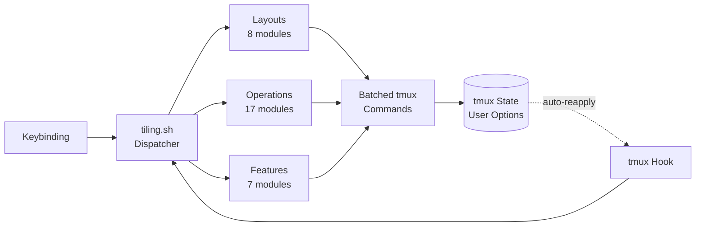

<div align="center">

<h1>tmux-tiling-revamped</h1>

<strong>BSP tiling window management for tmux. Eight layouts, nineteen operations, zero dependencies.</strong>

<br>
<br>

[](https://github.com/tmux-revamped/tmux-tiling-revamped/actions/workflows/ci.yml)
[](LICENSE)
[](CHANGELOG.md)
[](https://github.com/tmux/tmux)
[](https://www.gnu.org/software/bash/)

</div>

---

**8** layouts  ·  **16** BSP orientations  ·  **19** operations  ·  **36+** commands  ·  **691** tests  ·  **zero** dependencies

<table>
<tr>
<td width="50%" valign="top">

### BSP Tiling

Dwindle and spiral layouts with 16 orientation variants and configurable first-split ratio. Panes cascade into binary space partitions toward any corner.

</td>
<td width="50%" valign="top">

### Layout Undo

Every layout change is saved to a per-window history stack. One keystroke reverts to the previous arrangement. Up to 10 levels deep.

</td>
</tr>
<tr>
<td width="50%" valign="top">

### i3-Style Workspaces

Alt+1-9 switches windows. Alt+Shift+1-9 moves panes between windows. International keyboard support via configurable Shift+number mappings.

</td>
<td width="50%" valign="top">

### fzf Layout Picker

Interactive popup with ASCII diagram previews for all 8 layouts. Shows current layout in the header. Configurable popup dimensions.

</td>
</tr>
<tr>
<td width="50%" valign="top">

### Balanced Distribution

Main-center distributes extra panes evenly between left and right columns. All layouts verified balanced at pane counts 1-10 with 48 dedicated tests.

</td>
<td width="50%" valign="top">

### Diagnostics Built In

`doctor` checks your environment. `info` shows current state. `validate` detects stale metadata. `help` prints a complete reference from the terminal.

</td>
</tr>
</table>

## Why

tmux has five built-in layouts. None do BSP tiling. Existing plugins each solve a piece but leave gaps.

| Capability | tiling-revamped | tmux-tilish | tmux-tilit |
|:-----------|:---------------:|:-----------:|:----------:|
| BSP dwindle + spiral | Yes | No | No |
| 16 orientation variants | Yes | No | No |
| Configurable split ratio | Yes | No | No |
| Layout undo/redo | Yes | No | No |
| Layout picker (fzf) | Yes | No | No |
| Balanced main-center | Yes | No | No |
| Workspace switching | Yes | Yes | Yes |
| Project launcher | Yes | Yes | No |
| Pane marks | Yes | No | No |
| Scratchpads | Yes | No | No |
| Presets (save/restore) | Yes | No | No |
| Health check (doctor) | Yes | No | No |
| tmux-resurrect integration | Yes | No | No |
| Rotate / flip | Yes | No | No |
| Auto-reapplication | Yes | Yes | Yes |
| Vim-aware navigation | Yes | Yes | Yes |
| International keyboards | Yes | Yes | Yes |

## Architecture



State is stored in tmux user options at window, pane, or global scope. No temp files, no external state.

## Layouts

### Dwindle

BSP cascade toward a corner. Each new pane takes half of the remaining space.

**4 panes**

```
┌───────────────────┬───────────────────┐
│                   │                   │
│                   │         2         │
│         1         │                   │
│                   ├─────────┬─────────┤
│                   │         │         │
│                   │    3    │    4    │
└───────────────────┴─────────┴─────────┘
```

### Spiral

Same BSP algorithm as dwindle, but the spiral trajectory reverses pane ordering at each depth. The frame is identical to dwindle, only the pane numbers differ.

**4 panes**

```
┌───────────────────┬───────────────────┐
│                   │                   │
│                   │         2         │
│         1         │                   │
│                   ├─────────┬─────────┤
│                   │         │         │
│                   │    4    │    3    │
└───────────────────┴─────────┴─────────┘
```

### Grid

Even N x M grid. Uses tmux's built-in tiled layout.

**4 panes**

```
┌───────────────────┬───────────────────┐
│                   │                   │
│         1         │         2         │
│                   │                   │
├───────────────────┼───────────────────┤
│                   │                   │
│         3         │         4         │
│                   │                   │
└───────────────────┴───────────────────┘
```

### Main-Center

Wide center pane with balanced side columns. Extra panes distribute evenly.

**6 panes**

```
┌─────────┬───────────────────┬─────────┐
│    2    │                   │    4    │
├─────────┤                   ├─────────┤
│    3    │         1         │    5    │
│         │                   ├─────────┤
│         │                   │    6    │
└─────────┴───────────────────┴─────────┘
```

### Main-Vertical

Master left, stack right. Master size controlled by `@tiling_revamped_master_ratio`.

**4 panes**

```
┌───────────────────┬───────────────────┐
│                   │         2         │
│                   ├───────────────────┤
│         1         │         3         │
│                   ├───────────────────┤
│                   │         4         │
│                   │                   │
└───────────────────┴───────────────────┘
```

### Main-Horizontal

Master top, stack bottom. Master size controlled by `@tiling_revamped_master_ratio`.

**4 panes**

```
┌───────────────────────────────────────┐
│                                       │
│                  1                    │
│                                       │
├───────────┬───────────┬───────────────┤
│     2     │     3     │       4       │
└───────────┴───────────┴───────────────┘
```

### Monocle

Zoom the focused pane to fill the entire window. Press the same key again to toggle zoom off and restore the previous layout.

```
┌───────────────────────────────────────┐
│                                       │
│                                       │
│                  1                    │
│              [ZOOMED]                 │
│                                       │
│                                       │
└───────────────────────────────────────┘
(other panes hidden behind)
```

### Deck

All panes at full height, side by side at equal widths.

**4 panes**

```
┌─────────┬─────────┬─────────┬─────────┐
│         │         │         │         │
│         │         │         │         │
│    1    │    2    │    3    │    4    │
│         │         │         │         │
│         │         │         │         │
└─────────┴─────────┴─────────┴─────────┘
```

## Quick Start

### Prerequisites

| Tool | Version | Install |
|:-----|:--------|:--------|
| tmux | 3.2+ | [github.com/tmux/tmux](https://github.com/tmux/tmux) |
| bash | 4.0+ | Ships with Linux. macOS: `brew install bash` |
| TPM | latest | [github.com/tmux-plugins/tpm](https://github.com/tmux-plugins/tpm) |
| fzf | 0.44.0+ | Optional. Enables layout picker, fuzzy mark/preset selection |

### Install

Add to `~/.tmux.conf`:

```tmux
set -g @plugin 'tmux-revamped/tmux-tiling-revamped'
```

Press `prefix + I` to install via TPM.

### Verify

Open tmux, create a few panes, then press `prefix + d`. All panes rearrange into a dwindle layout.

## Default Keybindings

All keybindings use the tmux prefix. Every key is configurable via `@tiling_revamped_key_*` options.

Two features must never resolve to the same key. When they do, the key you set
wins over the one this plugin defaulted, the losing action stays unbound, and
the resolution is reported on start and left in `@tiling_revamped_conflicts`.

One combination collides out of the box: with `@tiling_revamped_alt_keys` and
`@tiling_revamped_navigator` both on, the navigator's `M-j` takes the key that
jump-to-mark would otherwise hold. Move `@tiling_revamped_key_jump` to a free
key to keep both.

| Key | Action | Command |
|:----|:-------|:--------|
| `d` | Apply dwindle layout | `layout dwindle` |
| `D` | Apply spiral layout | `layout spiral` |
| `v` | Apply main-vertical layout | `layout main-vertical` |
| `V` | Apply main-horizontal layout | `layout main-horizontal` |
| `b` | Balance panes | `balance` |
| `B` | Equalize panes | `equalize` |
| `m` | Promote focused pane to master | `promote` |
| `.` | Rotate layout 90 degrees | `rotate` |
| `,` | Flip layout horizontally | `flip` |
| `C-r` | Circulate panes | `circulate` |
| `C-d` | Smart split along longest axis | `autosplit` |
| `o` | Cycle to next layout | `cycle` |
| `+` | Grow master pane | `resize-master grow` |
| `-` | Shrink master pane | `resize-master shrink` |
| `S` | Toggle synchronize panes | `sync` |
| `M` | Mark pane with a name | `mark <name>` |
| `j` | Jump to marked pane | `jump` |
| `g` | Toggle scratchpad popup | `scratchpad` |
| `p` | Open layout picker | `pick` |
| `u` | Undo last layout change | `undo` |
| `r` | Redo last undone layout | `redo` |
| `=` | Swap focused pane with the largest | `swap-biggest` |
| `?` | Show keybinding overlay | `help-overlay` |
| `P` | Jump to any pane across sessions | `pane-jump` |
| `[` | Focus previously focused pane | `focus-back` |
| `]` | Focus forward in focus history | `focus-forward` |

## Configuration

All options use the `@tiling_revamped_` prefix.

### Behavior

| Option | Default | Description |
|:-------|:--------|:------------|
| `@tiling_revamped_auto_apply` | `1` | Reapply layout when panes are added or removed |
| `@tiling_revamped_default_layout` | (empty) | Auto-apply this layout on new windows |
| `@tiling_revamped_default_orientation` | `brvc` | Default BSP orientation for new windows |
| `@tiling_revamped_focus_resize` | `0` | Expand focused pane toward golden ratio on focus |
| `@tiling_revamped_focus_ratio` | `62` | Percentage of window for focused pane |
| `@tiling_revamped_master_ratio` | `60` | Master pane percentage for main-vertical and main-horizontal |
| `@tiling_revamped_main_center_ratio` | `60` | Width percentage for main-center center pane |
| `@tiling_revamped_split_ratio` | `50` | First BSP split ratio (20-80). Useful for ultrawide monitors |
| `@tiling_revamped_resize_step` | `5` | Percentage step for resize-master grow/shrink |
| `@tiling_revamped_cycle_layouts` | `dwindle spiral grid main-vertical main-horizontal main-center monocle deck` | Layout cycle order |
| `@tiling_revamped_alt_keys` | `0` | Use Alt keybindings (`M-<key>`) instead of prefix mode |
| `@tiling_revamped_navigator` | `0` | Vim-aware navigation. Set to `1` to enable `M-h/j/k/l` with vim detection |
| `@tiling_revamped_workspaces` | `0` | Enable i3-style Alt+1-9 workspace switching |
| `@tiling_revamped_shiftnum` | `!@#$%^&*()` | Shift+number characters for international keyboards |
| `@tiling_revamped_project_dir` | (empty) | Root directory for project launcher |
| `@tiling_revamped_project_depth` | `1` | Subdirectory depth for project search |
| `@tiling_revamped_scratch_width` | `80%` | Scratchpad popup width |
| `@tiling_revamped_scratch_height` | `75%` | Scratchpad popup height |
| `@tiling_revamped_pick_width` | `60%` | Layout picker popup width |
| `@tiling_revamped_pick_height` | `40%` | Layout picker popup height |
| `@tiling_revamped_pick_preview_width` | `60%` | Layout picker preview panel width |
| `@tiling_revamped_smart_borders` | `0` | Hide pane borders while a window holds a single pane |
| `@tiling_revamped_border_status` | `top` | Border status restored when a second pane appears |
| `@tiling_revamped_help_width` | `50%` | Help overlay popup width |
| `@tiling_revamped_help_height` | `60%` | Help overlay popup height |
| `@tiling_revamped_min_pane_width` | `10` | Minimum pane width before layout refuses to apply |
| `@tiling_revamped_min_pane_height` | `5` | Minimum pane height before layout refuses to apply |
| `@tiling_revamped_enable_logging` | `0` | Write debug logs to `~/.tmux/tiling-logs/` |

### Custom Keybindings

```tmux
set -g @tiling_revamped_key_dwindle         "d"
set -g @tiling_revamped_key_spiral          "D"
set -g @tiling_revamped_key_main_vertical   "v"
set -g @tiling_revamped_key_main_horizontal "V"
set -g @tiling_revamped_key_balance         "b"
set -g @tiling_revamped_key_equalize        "B"
set -g @tiling_revamped_key_promote         "m"
set -g @tiling_revamped_key_rotate          "."
set -g @tiling_revamped_key_flip            ","
set -g @tiling_revamped_key_circulate       "C-r"
set -g @tiling_revamped_key_autotile        "C-d"
set -g @tiling_revamped_key_cycle           "o"
set -g @tiling_revamped_key_master_grow     "+"
set -g @tiling_revamped_key_master_shrink   "-"
set -g @tiling_revamped_key_sync            "S"
set -g @tiling_revamped_key_mark            "M"
set -g @tiling_revamped_key_jump            "j"
set -g @tiling_revamped_key_scratchpad      "g"
set -g @tiling_revamped_key_pick_layout     "p"
set -g @tiling_revamped_key_undo            "u"
set -g @tiling_revamped_key_redo            "r"
set -g @tiling_revamped_key_help            "?"
set -g @tiling_revamped_key_swap_biggest    "="
set -g @tiling_revamped_key_back_and_forth  "Tab"
set -g @tiling_revamped_key_pane_jump       "P"
set -g @tiling_revamped_key_focus_back      "["
set -g @tiling_revamped_key_focus_forward   "]"
set -g @tiling_revamped_key_project         ""

# Report a key that two features both resolve to (1 = message on start)
set -g @tiling_revamped_warn_conflicts      "1"

# Directional swap (disabled by default, set keys to enable)
set -g @tiling_revamped_key_swap_up    ""
set -g @tiling_revamped_key_swap_down  ""
set -g @tiling_revamped_key_swap_left  ""
set -g @tiling_revamped_key_swap_right ""
```

Set any key to `""` (empty string) to disable that binding entirely.

### Avoiding Key Conflicts in Prefix Mode

Several default keys conflict with common tmux bindings.

| Default Key | Conflicts With | Suggested Alternative |
|:------------|:---------------|:----------------------|
| `b` (balance) | `prefix + b` lists paste buffers | `=` |
| `M` (mark) | `prefix + M` is often used for scrollback | `N` |
| `j` (jump) | `prefix + j` navigates panes down | `G` |
| `+` (master grow) | `prefix + +` maximizes pane (zoom) | `}` |
| `-` (master shrink) | `prefix + -` splits vertically | `{` |
| `S` (sync) | `prefix + S` is commonly bound to sync-panes | `""` (disable) |
| `.` (rotate) | `prefix + .` moves pane to another window | `R` |
| `,` (flip) | `prefix + ,` renames window | `F` |
| `C-r` (circulate) | `prefix + C-r` is not commonly bound | `C-n` |
| `p` (pick layout) | `prefix + p` is previous-window | `P` |

### Layout Picker

Interactive fzf-based layout picker with ASCII diagram previews.

```
┌──────────────────────────────────────────────────────────────┐
│ Select layout:                                               │
│                        │ Dwindle Layout (4 panes)            │
│   > dwindle            │ ┌──────────┬──────────┐             │
│     spiral             │ │          │    2     │             │
│     grid               │ │    1     ├─────┬────┤             │
│     main-vertical      │ │          │  3  │ 4  │             │
│     main-horizontal    │ └──────────┴─────┴────┘             │
│     main-center        │ BSP cascade toward corner           │
│     monocle            │                                     │
│     deck               │                                     │
│                        │                                     │
│  Current: dwindle                                            │
└──────────────────────────────────────────────────────────────┘
```

The picker shows ASCII diagrams in a preview panel on the right side. Each layout displays a representative configuration. The current layout is shown in the header.

Requirements: fzf >= 0.44.0.

### Layout Cycling

```
dwindle --> spiral --> grid
  ^                     |
  |    main-vertical <--+
  |         |
  |    main-horizontal
  |         |
  |    main-center
  |         |
  |    monocle
  |         |
  +--- deck +
```

### BSP Orientation Flags

A 4-character string controlling how the BSP tree cascades. Each character is one binary choice.

| Position | Values | Meaning |
|:---------|:-------|:--------|
| 1 | `t` / `b` | Top or bottom corner |
| 2 | `l` / `r` | Left or right corner |
| 3 | `h` / `v` | Horizontal or vertical first split |
| 4 | `c` / `s` | Corner (dwindle) or spiral trajectory |

Default: `brvc` (bottom-right, vertical, corner).

### Status Line

The active layout name is stored in the `@tiling_revamped_layout` window option, so the raw name drops straight into the status line:

```tmux
set -g status-right "#{@tiling_revamped_layout} | %H:%M"
```

For an icon plus the name, call the `status` command, which maps each layout to a glyph:

```tmux
set -g status-right "#(~/.tmux/plugins/tmux-tiling-revamped/src/tiling.sh status) | %H:%M"
```

The glyph map covers all eight layouts. An unset layout prints nothing, and an unknown name falls back to the bare name.

### Help Overlay

Press `?` to open a popup listing every resolved keybinding, reflecting your custom keys rather than the defaults. The overlay needs tmux 3.2 or newer for `display-popup`; on older tmux it prints a short message instead.

## CLI

The dispatcher at `src/tiling.sh` accepts direct commands for scripting and custom bindings.

```bash
# Layouts
./src/tiling.sh layout dwindle brvc
./src/tiling.sh layout spiral
./src/tiling.sh layout grid
./src/tiling.sh layout main-center
./src/tiling.sh layout main-vertical
./src/tiling.sh layout main-horizontal
./src/tiling.sh layout monocle
./src/tiling.sh layout deck

# Operations
./src/tiling.sh balance
./src/tiling.sh equalize
./src/tiling.sh rotate 180
./src/tiling.sh flip v
./src/tiling.sh promote
./src/tiling.sh circulate prev
./src/tiling.sh autosplit
./src/tiling.sh resize-master grow
./src/tiling.sh sync
./src/tiling.sh swap R
./src/tiling.sh swap-pick
./src/tiling.sh pick
./src/tiling.sh cycle next
./src/tiling.sh undo
./src/tiling.sh redo
./src/tiling.sh swap-biggest
./src/tiling.sh smart-borders

# Features
./src/tiling.sh mark editor
./src/tiling.sh jump editor
./src/tiling.sh scratchpad htop
./src/tiling.sh preset save dev
./src/tiling.sh preset apply dev
./src/tiling.sh workspace 3
./src/tiling.sh move-to-workspace 5
./src/tiling.sh back-and-forth
./src/tiling.sh project

# Diagnostics
./src/tiling.sh info
./src/tiling.sh status
./src/tiling.sh help-overlay
./src/tiling.sh doctor
./src/tiling.sh validate fix
./src/tiling.sh restore-layouts
./src/tiling.sh help
```

## How It Works

The core BSP algorithm computes a tmux custom layout string mathematically, then applies it in a single `select-layout` call.

**Step 1: Build.** `_bsp_build()` recursively divides the window into a binary tree. At each depth, the orientation flags determine the split direction. At depth 0, the configurable `split_ratio` controls the first division. The output is a tmux layout string:

```
200x50,0,0{100x50,0,0,0,100x50,101,0[100x24,101,0,1,100x25,101,25{50x25,101,25,2,49x25,152,25,3}]}
```

**Step 2: Checksum.** `_layout_checksum()` computes the CRC-16 prefix that tmux requires.

**Step 3: Apply.** `select-layout <checksum>,<layout_body>` positions all panes in one call. For spiral layouts, `_bsp_fix_pane_order()` swaps panes to the correct BSP depth positions.

State is stored in tmux user options:

| Option | Scope | Purpose |
|:-------|:------|:--------|
| `@tiling_revamped_layout` | window | Current layout name |
| `@tiling_revamped_orientation` | window | BSP orientation flags |
| `@tiling_revamped_layout_history` | window | Undo stack (pipe-separated) |
| `@tiling_revamped_applying` | global | Recursion guard |
| `@tiling_revamped_mark` | pane | Mark name |
| `@tiling_revamped_marks` | global | Mark index |

<details>
<summary><strong>Project structure</strong></summary>

```
tmux-tiling-revamped.tmux     # TPM entry point: keybindings, hooks, version gates
src/
  tiling.sh                   # Command dispatcher with help text
  lib/
    layouts/
      dwindle.sh              # BSP dwindle + shared _apply_bsp_layout
      spiral.sh               # BSP spiral (delegates to dwindle)
      grid.sh                 # Even grid via tmux tiled
      main-center.sh          # Balanced center pane with side columns
      main-vertical.sh        # Master left, stack right
      main-horizontal.sh      # Master top, stack bottom
      monocle.sh              # Zoom toggle
      deck.sh                 # Full-height equal-width cards
    operations/
      balance.sh              # Equalize sizes within topology
      equalize.sh             # Force even distribution
      rotate.sh               # Rotate orientation 90/180/270
      flip.sh                 # Mirror horizontally or vertically
      promote.sh              # Swap focused pane with master
      circulate.sh            # Shift pane positions
      autosplit.sh            # Smart split along longest axis
      focus-resize.sh         # Golden ratio resize on focus
      resize-master.sh        # Grow or shrink master pane
      sync.sh                 # Toggle synchronize-panes
      swap-direction.sh       # Swap with directional neighbor
      swap-pick.sh            # Swap with fzf-selected pane
      pick-layout.sh          # fzf layout picker with previews
      undo-layout.sh          # Layout history and undo
      validate.sh             # Layout metadata validation
      info.sh                 # Current state display
      doctor.sh               # Environment health check
    features/
      marks.sh                # Named pane labels with fzf jump
      scratchpad.sh           # Persistent popup sessions
      presets.sh              # Save and restore layout configs
      cycle.sh                # Step through layout list
      workspaces.sh           # i3-style window switching
      project-launcher.sh     # fzf project directory opener
      resurrect.sh            # tmux-resurrect layout restore
    tmux/
      tmux-ops.sh             # Get/set tmux options
      tmux-config.sh          # Option helpers, reapply helper
    utils/
      constants.sh            # Option names and defaults
      error-logger.sh         # Rotating log file
      has-command.sh           # Command existence check
      pane-guard.sh           # Minimum pane size checker
      deprecation.sh          # Option migration warnings
test/
  helpers.bash                # Mock tmux for unit tests
  tmux_helpers.bash           # Real tmux server for integration tests
  integration.bats            # 64 end-to-end scenarios
  balance.bats                # 48 balance invariant tests
  lib/                        # 40 unit test files mirroring src/lib/
```

</details>

## Development

| Command | Description |
|:--------|:------------|
| `make test` | Run the full bats suite |
| `make test-unit` | Run unit tests only |
| `make lint` | ShellCheck all shell files |
| `make clean` | Remove temp test artifacts |
| `bats --recursive test/` | Run all 528 tests recursively |

## License

[MIT](LICENSE)

<!-- family:begin -->

## The tmux-revamped family

This plugin is one member of the tmux-revamped family. Every member carries the
same contract in [`FAMILY.md`](FAMILY.md), the same tooling under `family/`, and
the same shared library, all held byte-identical by a checksum manifest. They are
built to be installed together: no member claims a key or a tmux option that
another member claims.

A defect found in one member is hunted across all of them before the fix is
called done. That obligation is written into the contract rather than left to
memory, and `family/bin/sweep` is how it is discharged.

| Member | What it does |
|---|---|
| [`tmux-autoreload-revamped`](https://github.com/tmux-revamped/tmux-autoreload-revamped) | Edit your tmux config, save, and watch it reload itself, no key, no command |
| [`tmux-battery-revamped`](https://github.com/tmux-revamped/tmux-battery-revamped) | Battery status for your tmux status bar, without ever blocking the status render |
| [`tmux-bluetooth-revamped`](https://github.com/tmux-revamped/tmux-bluetooth-revamped) | Every connected Bluetooth device and its battery in your tmux status bar, without blocking the render |
| [`tmux-cpu-revamped`](https://github.com/tmux-revamped/tmux-cpu-revamped) | CPU load, temperature, and frequency in your tmux status bar, without ever blocking the render |
| [`tmux-disk-revamped`](https://github.com/tmux-revamped/tmux-disk-revamped) | Disk usage for your tmux status bar, without ever blocking the status render |
| [`tmux-extract-revamped`](https://github.com/tmux-revamped/tmux-extract-revamped) | Fuzzy-grab any URL, path, or word off the screen and paste it, pure shell, no Python |
| [`tmux-fzf-revamped`](https://github.com/tmux-revamped/tmux-fzf-revamped) | Jump to any session, window, or pane, or kill it, from one fzf popup |
| [`tmux-git-revamped`](https://github.com/tmux-revamped/tmux-git-revamped) | Git repository status in your tmux status bar, without ever blocking the render |
| [`tmux-gpu-revamped`](https://github.com/tmux-revamped/tmux-gpu-revamped) | GPU load, temperature, frequency, and memory for your tmux status bar |
| [`tmux-kube-revamped`](https://github.com/tmux-revamped/tmux-kube-revamped) | Current Kubernetes context and namespace in your tmux status bar, async, kubectl-free, never blocking |
| [`tmux-launcher-revamped`](https://github.com/tmux-revamped/tmux-launcher-revamped) | Launch any TUI app in a popup or a window, scoped to the current pane's directory, with one configurable bindi |
| [`tmux-logging-revamped`](https://github.com/tmux-revamped/tmux-logging-revamped) | Capture any pane to a file: live logging, full scrollback, or a one-shot screenshot |
| [`tmux-music-revamped`](https://github.com/tmux-revamped/tmux-music-revamped) | Now playing in your tmux status bar, without ever blocking the status render |
| [`tmux-network-revamped`](https://github.com/tmux-revamped/tmux-network-revamped) | Network throughput in your tmux status bar, without ever blocking the render |
| [`tmux-pain-control-revamped`](https://github.com/tmux-revamped/tmux-pain-control-revamped) | Standard pane and window management bindings for tmux, version aware, vim friendly, and fully configurable |
| [`tmux-persist-revamped`](https://github.com/tmux-revamped/tmux-persist-revamped) | One plugin that captures every session, window, pane, layout, and working |
| [`tmux-plugin-template`](https://github.com/tmux-revamped/tmux-plugin-template) | A template for building non-blocking tmux status plugins |
| [`tmux-pomodoro-revamped`](https://github.com/tmux-revamped/tmux-pomodoro-revamped) | A Pomodoro timer in your tmux status bar, with zero temp files: all state lives in tmux options |
| [`tmux-ram-revamped`](https://github.com/tmux-revamped/tmux-ram-revamped) | RAM usage for your tmux status bar, without ever blocking the status render |
| [`tmux-scroll-revamped`](https://github.com/tmux-revamped/tmux-scroll-revamped) | Mouse wheel that does the right thing: scroll the app directly, copy-mode everywhere else. No app names to con |
| [`tmux-sensible-revamped`](https://github.com/tmux-revamped/tmux-sensible-revamped) | Sensible tmux defaults that normalize behavior across every tmux version, OS, and terminal, without clobbering |
| [`tmux-tiling-revamped`](https://github.com/tmux-revamped/tmux-tiling-revamped) | **this plugin**, --- |
| [`tmux-time-revamped`](https://github.com/tmux-revamped/tmux-time-revamped) | Local clock and world clocks in your tmux status bar, without ever blocking the render |
| [`tmux-weather-revamped`](https://github.com/tmux-revamped/tmux-weather-revamped) | Weather in your tmux status bar, fetched in the background so the render never waits on the network |

### Checking an installation

With every member on disk, one command reports any conflict between them:

```sh
family/bin/doctor --live
```

It reads each member and the running tmux server, and reports duplicate keys,
duplicate status placeholders, options outside the naming grammar, and any
member whose contract version has fallen behind.

<!-- family:end -->
